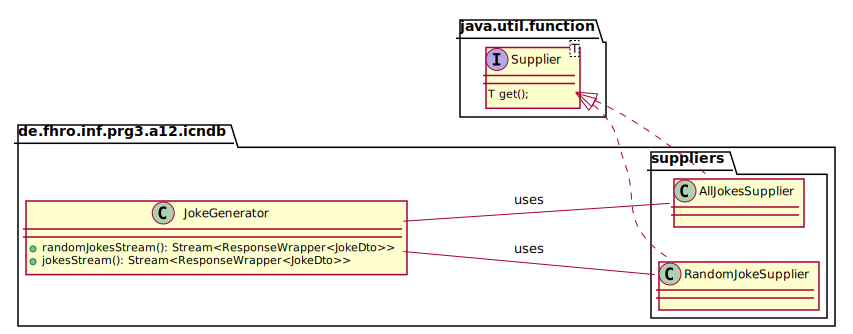
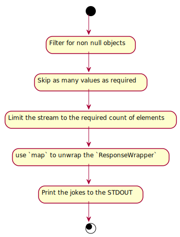

_This is an assignment to the class [Programmieren 3](https://hsro-inf-prg3.github.io) at the [University of Applied Sciences Rosenheim](http://www.fh-rosenheim.de)._

# Assignment 12: Functional - CLI variant

This assignment covers the basics of the Java 8 `Stream` API.
Streams are a functional concept and are relatively new in Java but they are very useful in combination with all kinds of _iterable_ data sources.
Streams may look a little bit complicated but when you got the concept they improve the readability of your code because they are more _data pipeline_ oriented as normal Java code is where you always have to iterate a collection with any kind of loop.

## Setup

1. Create a fork of this repository (button in the right upper corner)
1. Clone the project (get the link by clicking the green _Clone or download button_)
1. Import the project to your **IntelliJ**

_Remark: the given test suite will not completely succeed until you completed the first part of the assignment._

## Generators

A generator is component that creates a `Stream`.
There are two kinds of streams:

* finite
* infinite

A stream based on a list of objects is a finite stream as there are only a discrete number of elements that can be iterated.

Infinite streams are seaming to be a little bit weard but they are also very useful.
Think of a pseudo random number generator.
An infinite stream may be used to produce as many random numbers as required.
This generator may be implemented like this:

```java
public abstract class PseudoRandomNumberGenerator {

    private PseudoRandomNumberGenerator() {
    }

    public static Stream<Integer> createStream() {
        return Stream.generate(new PseudoRandomNumberSupplier());
    }

    private static class PseudoRandomNumberSupplier implements Supplier<Integer> {

        private final Random random = new Random();

        @Override
        public Integer get() {
            return random.nextInt();
        }
    }
}
```

The stream may be used like this:

```java
Stream<Integer> prngStream = createStream();
prngStream
        .limit(10)
        .forEach(System.out::println);
```

_Note that the `limit(...)` operation is mandatory because the stream is infinite and otherwise the whole operation will not terminate!_

In this part of the assignment you have to implement two generators as shown in the following UML:



_Remark: the UML is incomplete and is meant as implementation hint!_

1. Implement the `RandomJokeSupplier` - this supplier returns a random joke everytime it is used.
1. Implement the `AllJokesSupplier` - this supplier iterates all jokes in an infinite loop i.e. if all jokes were retrieved it continues with the first joke.
1. Implement the `JokeGenerator` - the generator returns infinite streams based on the implemented suppliers.

Note that the class structure is already there.

_Side note: when you have completed the implementation of the suppliers and the generator you can test your implementation with the given test suite._

## Using the generators

The given class `App` already implements a basic _CLI_ interface.
To complete the assignment implement the required code marked with a _TODO_.

The following flow diagram explains how to use the `jokesSource`:



Every chart element corresponds to a single method call on the stream of jokes.
For further reading about the Java 8 streams have a look at [this article](http://winterbe.com/posts/2014/07/31/java8-stream-tutorial-examples/).

_Remark: this part is technically an one-liner. To improve the readability add line breaks after every stream transformation. That should result in 5-6 lines of code._

If you want to improve your knowledge about streams you could extend the assignment by asking the user if he wants to filter the jokes for a specific category and if so which category (read the category as string).
Then `filter` the stream after the _unwrap_ transformation for the chosen category.